# Diagrama de flujo — Plataforma Küche

Diagrama de flujo de la aplicación **dividido en 4 partes** para que cada una sea fácil de leer y de visualizar en Mermaid.

---

## Diagrama único (todo en uno)

Un solo flujo con la información completa: sitio público, login por rol, área admin con sus acciones y área empleado. Para verlo bien, copia el bloque en [mermaid.live](https://mermaid.live) y usa zoom o exporta a PNG/SVG.

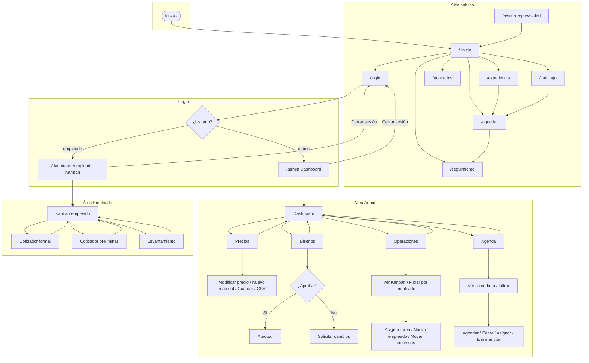

---

## Cómo está dividido

| Parte | Contenido | Uso |
|-------|-----------|-----|
| **1. Sitio público** | Inicio y páginas del Navbar (Experiencia, Catálogo, Acabados, Agendar, Seguimiento, Aviso, Login) | Flujo visitante/cliente |
| **2. Login y roles** | Pantalla de login y redirección a Admin o Empleado | Autenticación |
| **3. Área Admin** | Dashboard admin y sus 4 secciones (Precios, Diseños, Operaciones, Agenda) | Flujo interno admin |
| **4. Área Empleado** | Kanban empleado, Cotizador, Cotizador preliminar, Levantamiento | Flujo interno empleado |

Cada parte tiene su propio bloque Mermaid listo para copiar en [mermaid.live](https://mermaid.live).

---

## Parte 1 — Sitio público

Navegación desde Inicio y entre páginas públicas. El visitante puede ir a Agendar (CTA) o a Seguimiento (Mi proyecto).

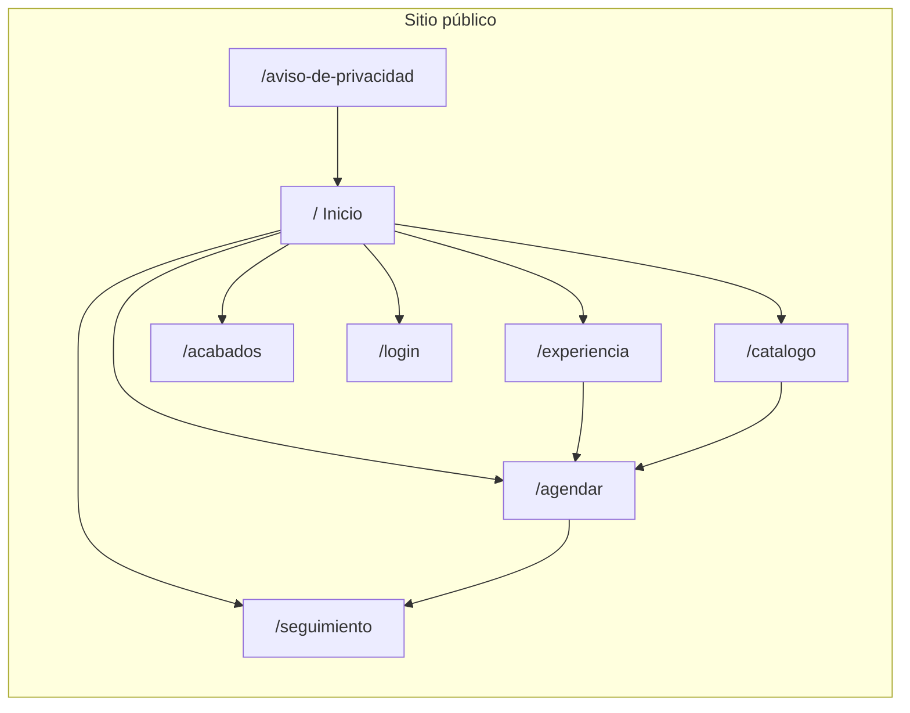

---

## Parte 2 — Login y roles

Una vez en `/login`, el usuario es redirigido según credenciales (demo: `admin` o `empleado`).

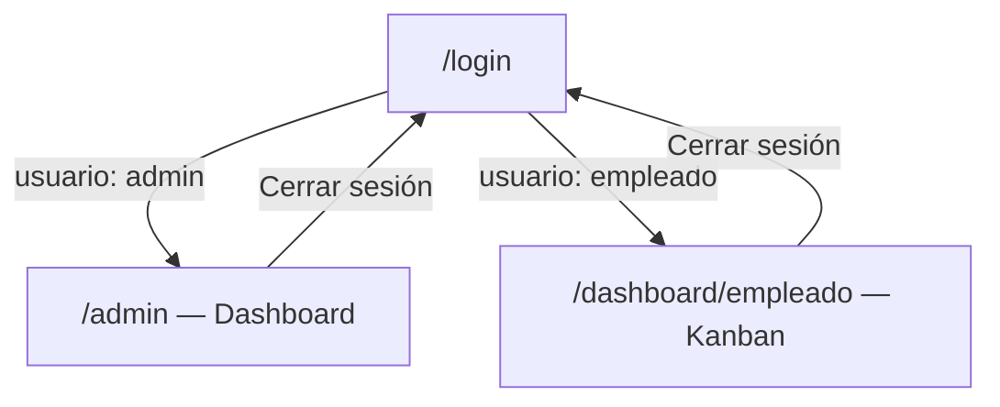

---

## Parte 3 — Área Admin

El admin entra por el Dashboard y desde ahí accede a las 4 secciones. Cada sección tiene sus propias acciones (diagramas detallados más abajo).

### Diagrama único — Área Admin (3.1 a 3.5)

Versión simplificada: un nodo por sección con el resumen de acciones. Sin pasos "Entrar" ni "Ver"; solo lo que hace el admin en cada módulo.

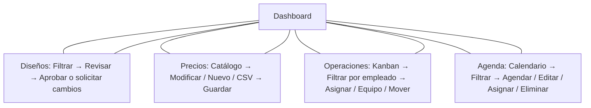

### 3.1 Navegación del Admin

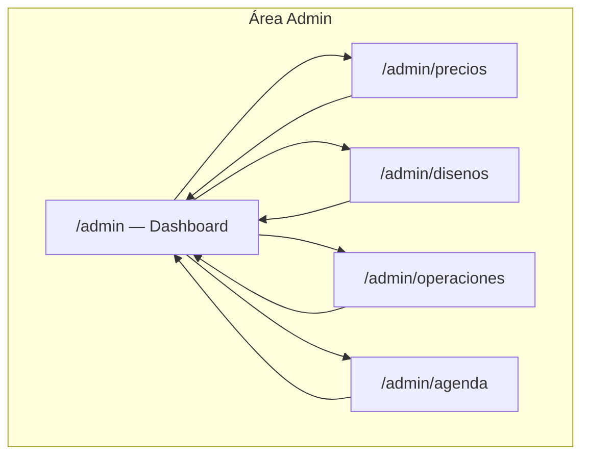

### 3.2 Diseños — Aprobar o desaprobar

En **Aprobación de Diseños** el admin revisa los renders antes de presentar al cliente. Puede aprobar o solicitar cambios (feedback).

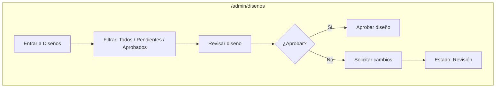

### 3.3 Precios — Modificar materiales

En **Catálogo y Precios** el admin actualiza los costos base que usan las cotizaciones. Puede modificar precios, agregar materiales y guardar (o importar/exportar CSV).

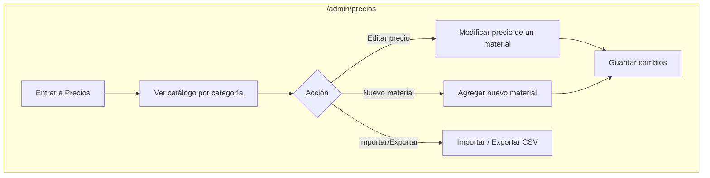

### 3.4 Operaciones — Pendientes y asignación

En **Operaciones y Taller** el admin ve todas las tareas en Kanban (Pendiente, En Progreso, Revisión, Completado), filtra por empleado para ver pendientes de cada uno, asigna nuevas tareas y gestiona el equipo.

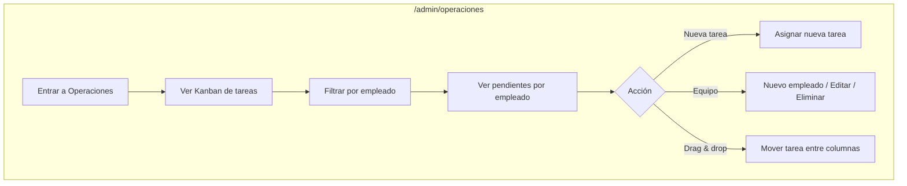

### 3.5 Agenda — Citas y gestión

En **Agenda** el admin ve todas las citas en el calendario, filtra por empleado o por "Citas sin asignar", agenda nuevas visitas, edita o elimina citas y asigna responsable a cada una.

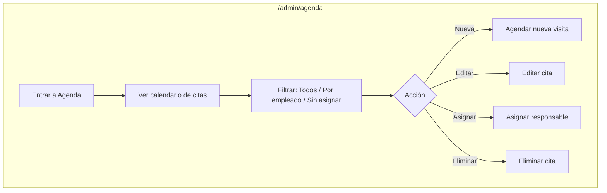

---

## Parte 4 — Área Empleado

El empleado ve su **Dashboard de trabajo** y desde ahí usa **Cotización Pro (formal)**, **Cotización Preliminar** y **actualiza los detalles de proyectos de los clientes**.

### Diagrama único — Área Empleado

Versión simplificada: un nodo por módulo con el resumen de acciones. Kanban es el centro; los tres flujos salen y vuelven a él.

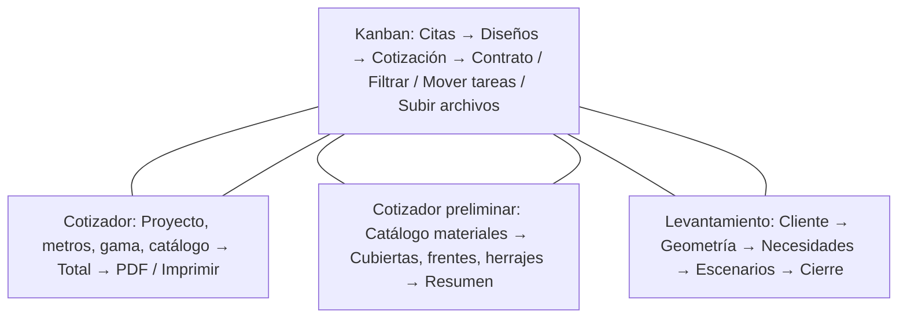

### Diagrama — Dashboard, Cotización Pro, Preliminar y detalles de proyectos

Flujo del empleado: entra al Dashboard de trabajo y elige Cotización Pro, Cotización Preliminar o actualizar detalles de proyectos de clientes; cada flujo vuelve al Dashboard.

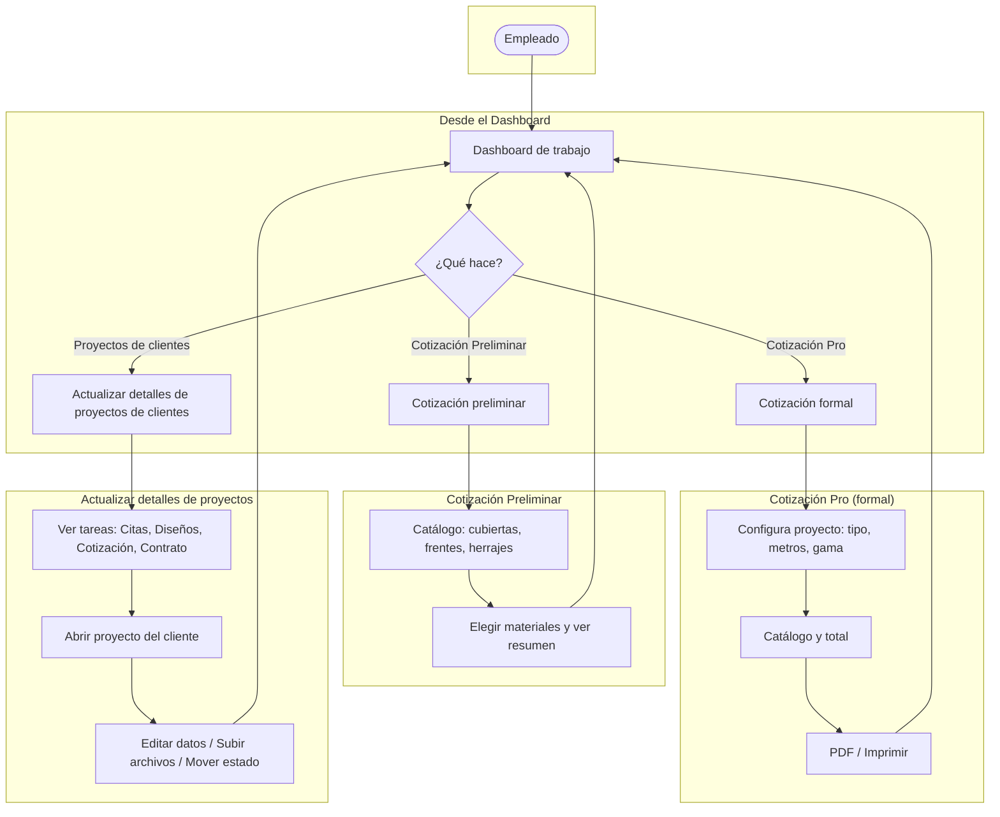

---

## Flujo por rol

### 1. Visitante (público)

| Origen        | Destino típico   | Descripción                          |
|---------------|------------------|--------------------------------------|
| Inicio `/`    | Experiencia      | Conocer proceso Küche                |
| Inicio `/`    | Catálogo         | Ver proyectos / tipos               |
| Inicio `/`    | Acabados         | Ver materiales y acabados            |
| Inicio `/`    | Agendar          | CTA principal: agendar cita          |
| Inicio `/`    | Mi proyecto      | Seguimiento (con código)             |
| Cualquier página | Login         | Acceso interno (footer/nav)          |

### 2. Cliente (después de agendar)

| Paso   | Ruta / acción      | Descripción                                      |
|--------|--------------------|--------------------------------------------------|
| 1      | `/agendar`         | Elige fecha, horario y detalles del proyecto     |
| 2      | (Levantamiento)    | Sección en misma página: datos para levantamiento|
| 3      | `/seguimiento`     | Consulta “Mi proyecto” (código, timeline, pagos) |

### 3. Admin (login: `admin`)

| Paso   | Ruta / acción       | Descripción                                      |
|--------|---------------------|--------------------------------------------------|
| 1      | `/login`            | Usuario: `admin`                                 |
| 2      | `/admin`            | Dashboard: tareas, diseños, agenda, precios      |
| 3      | `/admin/operaciones`| Kanban de tareas / taller                        |
| 4      | `/admin/disenos`    | Aprobación de diseños                            |
| 5      | `/admin/agenda`     | Gestión de citas y asignación                    |
| 6      | `/admin/precios`    | Catálogo y precios                               |
| Salir  | Cerrar sesión       | Vuelve a `/login`                                |

### 4. Empleado (login: `empleado`)

| Paso   | Ruta / acción                | Descripción                                      |
|--------|------------------------------|--------------------------------------------------|
| 1      | `/login`                     | Usuario: `empleado`                              |
| 2      | `/dashboard/empleado`        | Kanban: Citas → Diseños → Cotización → Contrato  |
| 3      | Cotizador formal             | Ir a `/dashboard/cotizador` (cotización detallada)|
| 4      | Cotización preliminar        | Ir a `/dashboard/cotizador-preliminar`           |
| 5      | Levantamiento                | Ir a `/dashboard/levantamiento` (cliente, geometría, escenarios)|
| Salir  | Volver / Cerrar sesión       | Regreso a empleado o `/login`                    |

---

## Resumen de rutas

| Ruta | Quién | Descripción breve |
|------|--------|--------------------|
| `/` | Público | Inicio: hero, historia, proyectos, experiencia, testimonios, lead form, ubicación |
| `/experiencia` | Público | Experiencia de compra / proceso |
| `/catalogo` | Público | Catálogo de proyectos |
| `/acabados` | Público | Materiales y acabados |
| `/agendar` | Público | Agendar cita + datos levantamiento |
| `/seguimiento` | Público | Mi proyecto (seguimiento cliente) |
| `/aviso-de-privacidad` | Público | Aviso de privacidad |
| `/login` | Público | Login interno (admin / empleado) |
| `/admin` | Admin | Dashboard admin |
| `/admin/precios` | Admin | Precios y catálogo |
| `/admin/disenos` | Admin | Aprobación de diseños |
| `/admin/operaciones` | Admin | Operaciones y taller |
| `/admin/agenda` | Admin | Agenda |
| `/dashboard/empleado` | Empleado | Kanban del empleado |
| `/dashboard/cotizador` | Empleado | Cotizador formal (PDF, detalle) |
| `/dashboard/cotizador-preliminar` | Empleado | Cotización preliminar |
| `/dashboard/levantamiento` | Empleado | Levantamiento (cliente → geometría → necesidades → escenarios → cierre) |

---

## Notas técnicas

- **Layouts**: `layout.tsx` (raíz con Navbar), `admin/layout.tsx` (sidebar admin), `dashboard/layout.tsx` (contenedor dashboard).
- **Navbar**: No se muestra en rutas bajo `/admin`.
- **Auth**: Demo con usuario/contraseña en front; `admin` → `/admin`, `empleado` → `/dashboard/empleado`.
- **Persistencia**: Kanban, agenda y catálogo usan `localStorage` (demo).

Para ver el diagrama Mermaid renderizado, abre este archivo en GitHub, en un visor de Mermaid (por ejemplo [mermaid.live](https://mermaid.live)), o en un editor que soporte Mermaid (p. ej. VS Code con extensión Mermaid).
